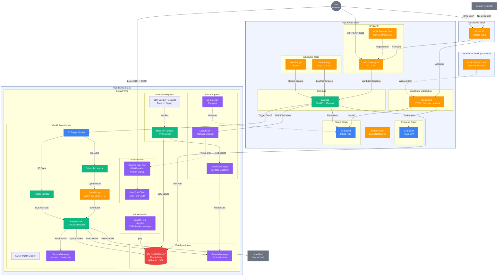
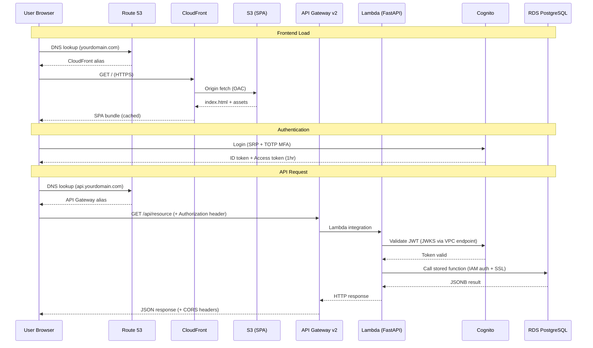
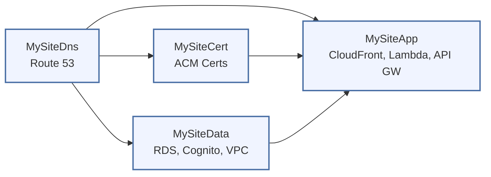

# Architecture Diagram

Interactive diagram of the production AWS infrastructure. Each account (production and staging) deploys the same 4 CDK stacks with environment-specific configuration.

> Staging deploys an identical stack structure in a separate AWS account with reduced retention, deletion protection disabled, and its own domain (`stage.yourdomain.com`).

## Infrastructure Overview

## Request Flow

## Stack Dependencies

